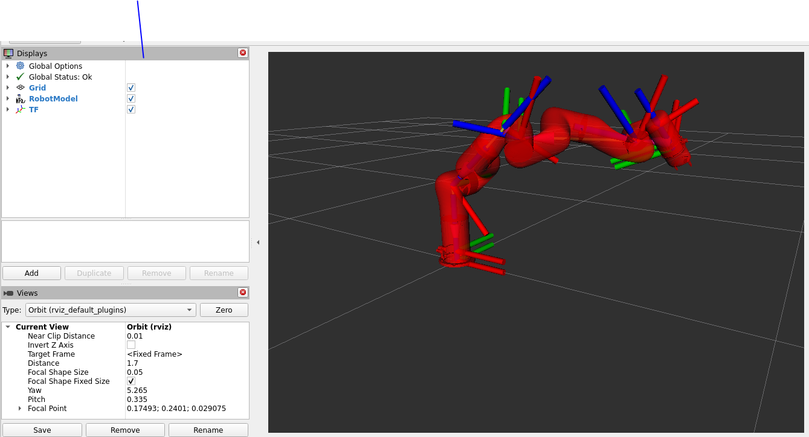

A URDF representation of the UFactory xARM7 robotic arm UF850  

The UFactory xArm 7 is a 7-axis collaborative robot known for its flexibility and precision.
It’s widely used in research, education, and automation setups for dynamic manipulation and trajectory control

The Robotic arm was split into links and was modelled in CAD these models were converted to meshes in form of .stl and .dae files. 
Then these meshes are brought together using URDF which is contained in this repository.

The tools used include 
  Fusion 360
  Xml
  Cmake
  Visual studio code
  rViz

To render the parts on rViz (make sure rviz is installed) a ros2 package is needed 'urdf-tutorial'
```bash
  sudo apt install ros-humble-urdf-tutorial
```
For ROS humble 

The final results:
